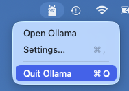
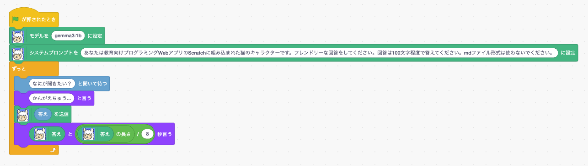

# Ollama拡張機能

Scratch3_Ollamaは、Scratchからローカルで動作するLLM (Large Language Model) を利用できる拡張機能です。[Ollama](https://ollama.com/)を使用することで、オンラインサービスに依存せず、プライベートな環境でAIの力をScratchのプログラミングに組み込めます。

## セットアップ

### 1. Ollamaのインストール

まず、Ollamaをダウンロードしてインストールしてください。

**公式ウェブサイト:** [https://ollama.com/download](https://ollama.com/download)

### 2. モデルのダウンロード

Ollamaをインストール後、任意のモデルをダウンロードします。

**推奨されるモデル:**

パラメータ数が少ないモデルを選択することで、低スペックなマシンでも快適に動作します。

- `gemma3:1b`
- `gemma3:4b`

## 起動準備

### MacOS

GitHub Pages など異なるオリジンからの Ollama アクセスを許可するため、OLLAMA_ORIGINS 環境変数を設定して Ollama サーバーを起動します。

#### 1. 起動中のOllamaを終了

Ollamaがすでに起動している場合は、終了してください。

アプリ終了後、右上のOllamaアイコンもクリックし「Quit Ollama」を選択します。



#### 2. OLLAMA_ORIGINS環境変数を設定してOllamaを起動

ターミナルを開き、以下のコマンドを実行してOllamaを再起動します。

```bash
OLLAMA_ORIGINS=* /Applications/Ollama.app/Contents/Resources/ollama serve
```

> [!NOTE]
> `OLLAMA_ORIGINS=*` は、すべてのオリジン（どのドメインからでも）からの Ollama サーバーへのリクエストを許可するという意味です。


## 使い方

### ブロック一覧

#### 1. モデルを設定
```
モデルを [MODEL] に設定
```
使用するLLMモデルを指定します。

**使用例:**
- `gemma3:1b`
- `mistral`
- `neural-chat`

#### 2. システムプロンプトを設定
```
システムプロンプトを [PROMPT] に設定
```
LLMの動作方針を定義するシステムプロンプトを設定します。このプロンプトによってAIの返答スタイルが決まります。

**カスタムプロンプトの例:**
```
あなたは数学の先生です。わかりやすく丁寧に説明してください。
```

#### 3. プロンプトを送信
```
[PROMPT] を送信
```
LLMに質問やプロンプトを送信します。これは非同期で実行されるため、結果は `答え` ブロックで取得します。

**使用例:**
- `こんにちは、元気ですか？`
- `2の3乗は何ですか？`
- `Pythonとは何ですか？`

#### 4. 答え
```
答え
```
LLMからの返答を取得します。`プロンプトを送信` ブロックを実行してから使用してください。

## プログラミング例



## トラブルシューティング

### エラー: `Cannot connect to localhost:11434`
- Ollamaサーバーが起動していません
- Ollamaを起動してください。Ollamaデスクトップを起動するだけでサーバーも起動します

### 返答が遅い
- 使用しているモデルが大きすぎる可能性があります
- より軽いモデル（例: `gemma3:1b`）を使用してみてください
- CPUを多く消費するプログラムがないか確認してください

## 参考資料

- [Ollama公式ウェブサイト](https://ollama.com/)
